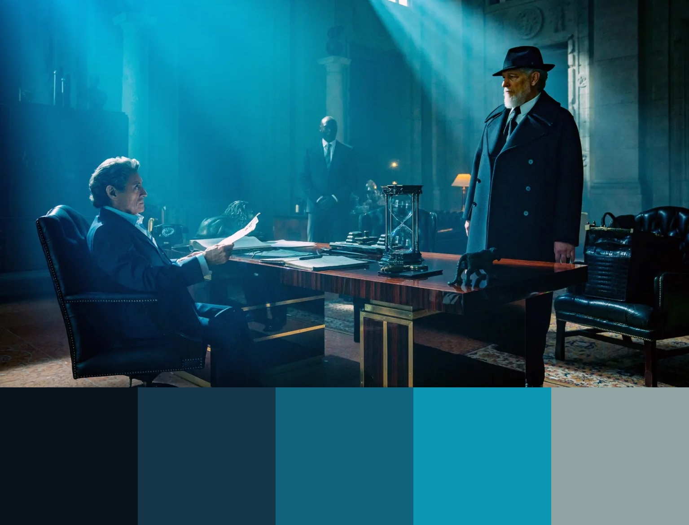

# color-palette-generator
A Python script that finds the dominant colors of an given image, and generates a color palette concatenated with the original image. See examples below:

Output images:\
\
\


Input images:\
\
\


The RGB values of each color will be printed in the terminal. In "gradient" mode, colors are sorted by the sum of their RGB values. In "frequency" mode, they are sorted by the corresponding cluster size.

"gradient" mode:\

"frequency" mode:\


## Prerequisites
1. Create a virtual environment and activate it:
```
$ python3 -m venv .venv
$ source .venv/bin/activate
```
2.  Install all dependencies:
```
(.venv) $ pip install -r requirements.txt
```

## Running and Testing
Run the generator with an input image:
```
(.venv) $ python generator.py /path/to/image
```
(Optional) Change the number of clusters or the generation mode, for example:
```
self.CLUSTERS = 7
self.MODE = "frequency"
```
Deactivate virtual environment if needed:
```
(.venv) $ deactivate
```